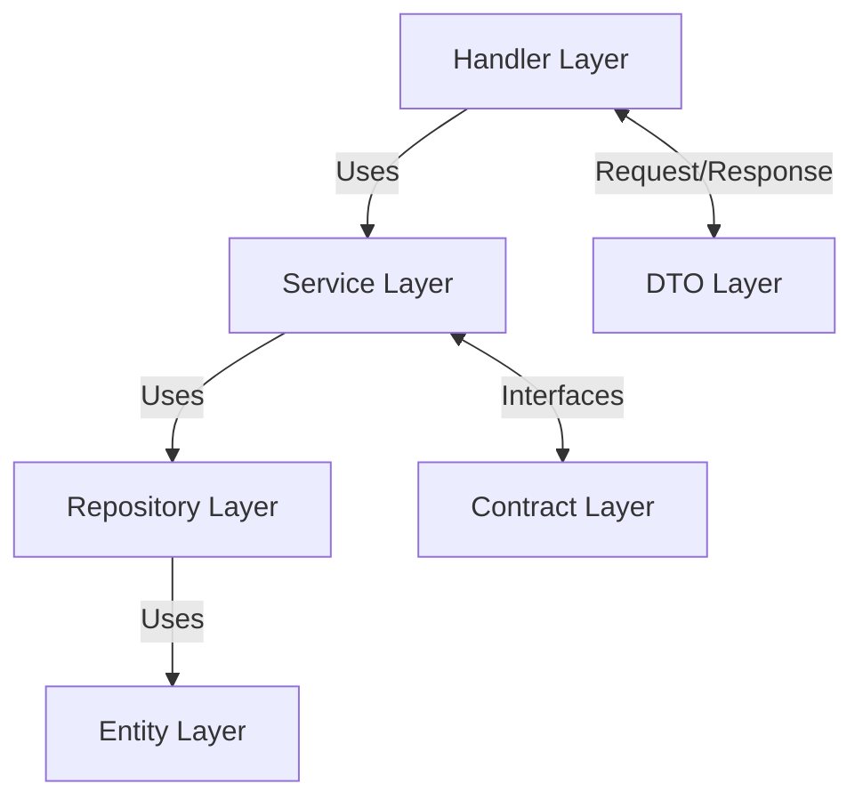

# Golang Tutorial Project

A Go-based REST API implementing a Layered (N-Tier) Architecture pattern using the Gin framework and PostgreSQL database.

## Architecture Overview

This project implements a Layered (N-Tier) Architecture for clean and maintainable code:



### Layer Descriptions

1. **Handler Layer** (`/handler`)

   - Manages HTTP requests and responses
   - Implements REST API endpoints
   - Routes requests to appropriate services

2. **Service Layer** (`/service`)

   - Contains business logic
   - Orchestrates data flow between handlers and repositories
   - Implements business rules and validations

3. **Repository Layer** (`/repository`)

   - Handles database operations
   - Implements data access patterns
   - Manages entity persistence

4. **Entity Layer** (`/entity`)

   - Defines database models
   - Represents data structures

5. **DTO Layer** (`/dto`)

   - Defines Data Transfer Objects
   - Handles request/response structures
   - Manages data transformation

6. **Contract Layer** (`/contract`)
   - Defines interfaces
   - Establishes boundaries between layers
   - Enables dependency injection

## Prerequisites

- Go 1.23.3
- PostgreSQL 16.4
- [Air](https://github.com/cosmtrek/air) (for live reload)

> [!note]
> Please check all of the software needed for the project to run successfully.

### How to check

#### go version

```bash
go version
```

#### psql version

Open psql and type

```bash
SELECT version();
```

## Configuration

Create a `.env` file in the root directory with the following variables:

```env
PORT=8080
IS_PRODUCTION=false

DB_USER=your_db_user
DB_PASS=your_db_password
DB_NAME=your_db_name
DB_HOST=localhost
DB_PORT=5432
DB_SSL_MODE=false
DB_TIME_ZONE=UTC
LIFE_TIME_TOKEN=3600
REFRESH_LIFE_TIME_TOKEN=86400
PRIVATE_KEY=
PUBLIC_KEY=
```

## Setup & Installation

1. Install dependencies:

   ```bash
   go mod tidy
   ```

2. Install Air for live reload:
   ```bash
   go install github.com/air-verse/air@latest
   ```
3. Generate Private Key and Public Key:

   ```bash
   openssl genrsa -out private_key.pem 2048 && openssl rsa -in private_key.pem -pubout -out public_key.pem
   ```

4. Set up the database:
   - Create a PostgreSQL database
   - Configure the `.env` file with your database credentials
   - Run migrations (migrations are automatically executed on startup)

## Running the Application

1. Start the development server with live reload:

   ```bash
   air
   ```

2. The server will start at `http://localhost:8080` (or the configured PORT)
